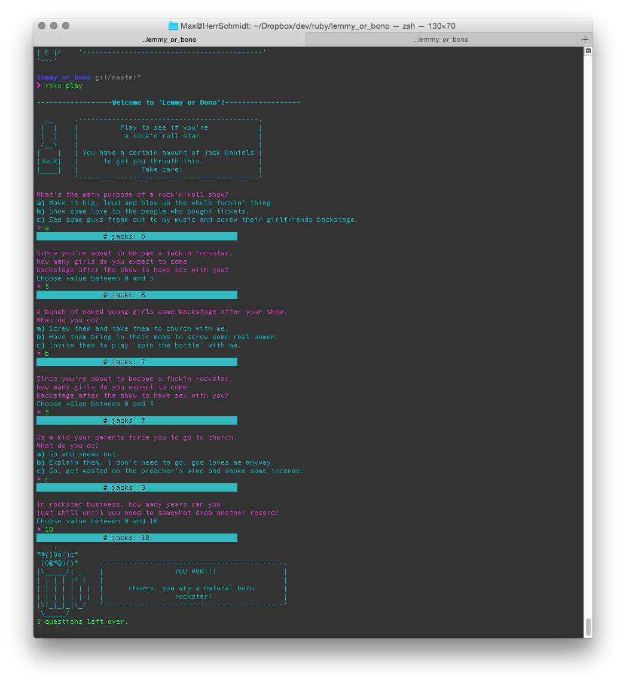

# Lemmy or Bono ?

"Lemmy or Bono ?"" is a funny little text-based commandline adventure game to determine whether you are a natural born rockstar (Lemmy) or basically just suck (Bono).<br>
I use this tiny project to experiment and play around with ruby. (*that's why this game is organized in a way more complex way than acually needed*)


## Getting Started

The game is implemented in Ruby 2.1. To get the required dependencies, navigate into the `lemmy_or_bono` folder and run
```ruby
bundle install
```
It will fetch all required Rubygems (you of course need [http://bundler.io/] installed for this).


Then, run
```ruby
rake play
```
to start the game.<br>
Within the game, answer questions by entering 'a', 'b', 'c' or a numberic value (integer) within the given answer range. Press enter after each answer to continue. Enjoy!


## Screenshot
